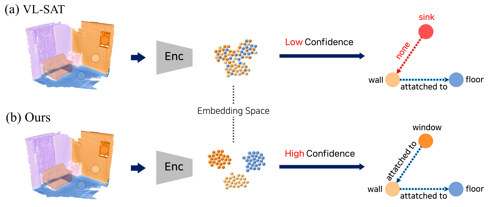

# 🌌 Object-Centric Representation Learning for 3D Semantic Scene Graph Prediction (NeurIPS 2025)
We propose a two-stage training framework for 3D Semantic Scene Graph Prediction. Our method focuses on learning discriminative object representations to improve predicate reasoning.   
If you found our insights are usefule, please help to ⭐ it or recommend it to your friends. Thanks!

Authors: **KunHo Heo***, **GiHyeon Kim***, SuYeon Kim, MyeongAh Cho  
*Equal Contribution

[\[Progect Page\]](https://visualsciencelab-khu.github.io/OCRL-3DSSG/)
[\[Paper\]](https://openreview.net/pdf?id=LjmXrUsSrg)
[\[Arxiv\]](https://arxiv.org/pdf/2510.04714)

<p align="center">
  
</p>

<p align="center">💡 Core contribution of our work: object representation is key bottleneck of predicate estimation.</p>

---

## 🚀 Environment Setup

### Step 1) Conda environment setup

Run this script on your cloud/local server.

```bash
conda create -n vlsat python=3.8
conda activate vlsat
pip install -r requirement.txt
pip install torch==1.12.1+cu113 torchvision==0.13.1+cu113 torchaudio==0.12.1 --extra-index-url https://download.pytorch.org/whl/cu113
pip install torch-scatter -f https://pytorch-geometric.com/whl/torch-1.12.1+cu113.html
pip install torch-sparse -f https://pytorch-geometric.com/whl/torch-1.12.1+cu113.html
pip install torch-spline-conv -f https://pytorch-geometric.com/whl/torch-1.12.1+cu113.html
pip install torch-geometric==2.2.0
pip install git+https://github.com/openai/CLIP.git
pip install hydra
pip install hydra-core --upgrade --pre
```

### Step 2) Download 3DSSG Dataset

#### 1. Download 3RScan  
First, download the 3RScan dataset. You can follow the instructions provided in the [3DSSG official guide](https://github.com/ShunChengWu/3DSSG#preparation).

#### 2. Generate 2D Multi-view Images  
Convert the point clouds into 2D images from multiple viewpoints. Make sure to update the internal path in the script to match your local environment.

```bash
# Modify the path in pointcloud2image.py to match your local environment.
python data/pointcloud2image.py
```

#### 3. Directory Structure  
Make sure your folders are organized as follows for proper operation:

```
data
  3DSSG_subset
    relations.txt
    classes.txt

  3RScan
    <scan_id_1>
      multi_view/
      labels.instances.align.annotated.v2.ply
    <scan_id_2>
    ...
```

---

## Training & Evaluation

We suggests two stage training method: Object Feature Learning & Scene Graph Prediction.

[\[SG Model Ckpt\]](https://drive.google.com/drive/folders/1UrEbwxPWuaJx_-dCPNRh-0RFTExTOg3C?usp=sharing)
[\[Object Encoder Ckpt\]](https://drive.google.com/drive/folders/1-p-m6fNOeKhdA4FT66W12evsqDlke7DB?usp=sharing)


#### Stage 1) Object Feature Learning

See [Here](https://github.com/VisualScienceLab-KHU/OCRL-3DSSG-Codes/tree/main/train_obj_encoder) to check OFL document.

#### Stage 2) Scene Graph Prediction

Training scene graph prediction can be conducted by following script.

```bash
# Train
python -m main --mode train --config <config_path> --exp <exp_name>

# Evaluate
python -m main --mode eval --config <config_path> --exp <exp_name>
```

## 📚 Citation

If you find our work useful, please cite:

```
@article{heo2025object,
  title={Object-Centric Representation Learning for Enhanced 3D Scene Graph Prediction},
  author={Heo, KunHo and Kim, GiHyun and Kim, SuYeon and Cho, MyeongAh},
  journal={arXiv preprint arXiv:2510.04714},
  year={2025}
}
```

## ✨ Acknowledgements

This work was supported by the National Research Foundation of Korea (NRF) grant funded by the Korea government (MSIT)(RS-2024-00456589) and Institute of Information & communications Technology Planning & Evaluation (IITP) grant funded by the Korea government (MSIT) (No. RS-2025-02263277 and RS-2022-00155911, Artificial Intelligence Convergence Innovation Human Resources Development (Kyung Hee University)).  
Also, this project is inspired by and partially based on the following repositories:

- [3DSSG](https://github.com/ShunChengWu/3DSSG)
- [VL-SAT (CVPR 2023)](https://github.com/wz7in/CVPR2023-VLSAT)